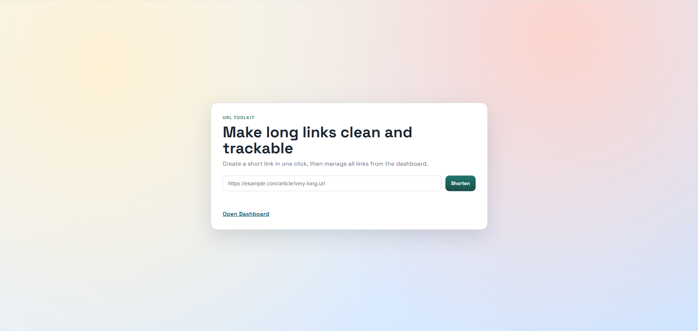

# URLShortener

一個輕量、可自行部署的短網址服務，使用 `Express` 與 `Firebase Realtime Database` 建置。

[English](./README.md) | 繁體中文



## 專案介紹

`URLShortener` 主要解決兩件事：

- 在首頁快速建立短網址
- 在管理後台搜尋、複製、刪除短網址，並查看點擊次數

## 功能清單

- 建立短網址：`POST /new`、`POST /new/`
- 原始網址驗證：僅接受 `http://`、`https://`
- 短碼唯一性檢查：避免碰撞
- 短網址轉址：`GET /:shortURL`
- 點擊次數統計：每次轉址自動累加
- 管理頁：`GET /dashboard`
- 管理 API：
  - 取得列表：`GET /api/urls`
  - 刪除短網址：`DELETE /api/urls/:shortURL`

## 安裝與設定

1. 複製環境變數檔：

```bash
cp .env.example .env
```

2. 在 `.env` 填入 Firebase 設定
3. 安裝套件：

```bash
npm install
```

## 啟動方式

開發模式：

```bash
npm run dev
```

正式模式：

```bash
npm run start
```

預設網址：`http://localhost:3000`

## 頁面路由

- 首頁：`GET /`
- 管理頁：`GET /dashboard`

## API 範例

建立：

```http
POST /new
```

```json
{
  "originalURL": "https://example.com/article/123"
}
```

```json
{
  "shortURL": "abc123xyz0"
}
```

列表：

```http
GET /api/urls
```

刪除：

```http
DELETE /api/urls/:shortURL
```

## 技術棧

- Node.js
- Express
- Firebase Realtime Database
- Nano ID
